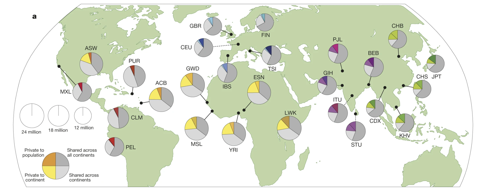

# Genome-wide association with quantitative antibody levels

In this tutorial, you will be exploring a dataset simulated from data in the **1000 Genomes Project**.  You will use
this data to test for an association between genotype and antibody response to
[norovirus](https://www.nature.com/articles/nature15393) in an admixed population derived from the Americas. 

Noroviruses are a leading cause of viral gastroenteritis, and are thought to be responsible for [over 200,000
deaths/year](https://www.cdc.gov/norovirus/downloads/global-burden-report.pdf), with the majority in children under 5
years of age.

The antibody response is a **quantitative phenotype**, so you will have to consider things like the best scale, or normalisation, of the phenotype to run the test.

:::tip The 1000 Genomes Project

The [1000 Genomes Project](https://www.nature.com/articles/nature15393) ran between 2008 and 2015, and generated genotype and sequence data from ~2500 individuals from around the world. At the time it was the largest single publicly available catalogue of human genomic data. The final dataset contains data from populations spanning Europe, East Asia, South Asia, Africa, and the Americas:

Importantly, the 1000 Genomes Project data is **open-access**, so that you can freely use it.  For more on the 1000 Genomes Project, read the [1000 Genomes Phase 3 paper](https://www.nature.com/articles/nature15393) or see the [https://www.internationalgenome.org].

:::

To get started, [go and get the data](./getting_the_data.md).

