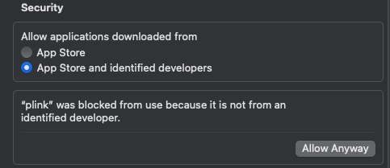

# Getting the software

In this tutorial we will use two pieces of software designed for GWAS analysis:

* [`plink 1.9` 'beta'](https://www.cog-genomics.org/plink/), which is a general-purpose tool for manipulating genome-wide data
* [`gcta`](https://yanglab.westlake.edu.cn/software/gcta/) which implements (amongst other thins) a **linear mixed model** for association analysis.

We will also R to make plots and (for one step) we'll write an exciting python script!

To make things as easy as possible, we have included both `plink` and `gcta` in the data tarball.

Look in the `software` folder and pick the relevant version for your platform.  

:::tip Windows note

Windows users should work in the Ubuntu for Windows system, and use the linux version.

:::

For this tutorial we recommend copying the relevant versions into the top-level `gwas_tutorial` folder
```
cp software/[version]/plink ./
cp software/[version]/gcta64 ./
```

You can then test the software out:
```
./plink
./gcta64
```

:::caution Mac firewall note

On a mac, you may need to allow access to this software using System Preferences. This lives in `System Preferences` ->
`Privacy and Security` -> scroll down to 'Security' pane.  **After** you have tried to run the software once, you should
see a box like this:



If you give permission, you're able to run the software on subsequent attempts.

:::


If all works out, you should now see a message like:

```
$ ./plink
PLINK v1.9.0-b.7.7 64-bit (22 Oct 2024)            cog-genomics.org/plink/1.9/
(C) 2005-2024 Shaun Purcell, Christopher Chang   GNU General Public License v3

  plink <input flag(s)...> [command flag(s)...] [other flag(s)...]
  plink --help [flag name(s)...]

Commands include --make-bed, --recode, --flip-scan, --merge-list,
--write-snplist, --list-duplicate-vars, --freqx, --missing, --test-mishap,
--hardy, --mendel, --ibc, --impute-sex, --indep-pairphase, --r2, --show-tags,
--blocks, --distance, --genome, --homozyg, --make-rel, --make-grm-gz,
--rel-cutoff, --cluster, --pca, --neighbour, --ibs-test, --regress-distance,
--model, --bd, --gxe, --logistic, --dosage, --lasso, --test-missing,
--make-perm-pheno, --tdt, --qfam, --annotate, --clump, --gene-report,
--meta-analysis, --epistasis, --fast-epistasis, and --score.

"plink --help | more" describes all functions (warning: long).
```

and

```
$ ./gcta64
*******************************************************************
* Genome-wide Complex Trait Analysis (GCTA)
* version v1.94.1 Mac
* (C) 2010-present, Yang Lab, Westlake University
* Please report bugs to Jian Yang <jian.yang@westlake.edu.cn>
*******************************************************************
Analysis started at 09:46:46 GMT on Wed Nov 06 2024.
Hostname: dhcp570.well.ox.ac.uk

Error: no analysis has been launched by the option(s)
Please see online documentation at https://yanglab.westlake.edu.cn/software/gcta/

```

Congratulations!  You're ready to start the tutorial.

