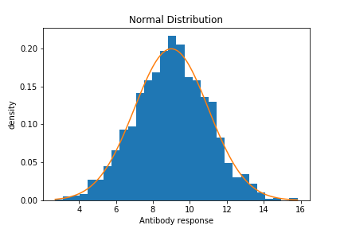
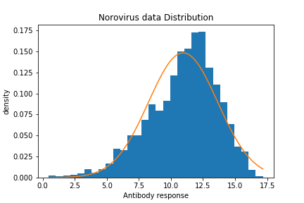

# Part 2: Transforming the phenotype data

Most commonly-used GWAS software implement
[logistic](../../statistical_modelling/regression_modelling/logistic_regression_1.md) or [linear
regression](../../statistical_modelling/regression_modelling/linear_regression_1.md) models to determine whether a SNP
is associated with the trait of interest.  Logistic models are used for categorical trait data such as case-control
studies, while linear models are used for continuous trait data (e.g. height).  Here, we will analyse a quantitative
phenotype (antibody response to Norovirus) so will focus on a linear model.

## Dealing with non-normality

Linear models rely on the assumption that the residuals (difference between observed and predicted dependent variable)
are normally distributed. To ensure that this assumption is met, it is important to know the distribution of the data,
and deal with any non-normality.  The simplest way to do that is to use a transformation to normalise the trait
data (if needed).  

To check whether the data follows a normal distribution, we will first generate a histogram of the data with R along
with measurements for how close to normal the distribution is This will tell us about the spread of the values and whether there may be any
unusually high or low readings (outliers) that might bias the results. A normal distribution should follow a regular
curve like this:



But our antibody response data looks like this:



As you can see, our data is not quite normally distributed.

At this point you have two options.  One is to go ahead and analyse anyway.  This has the major advantage that **it does not change the scale of the data**. (Thus, estimates are interpretable on the original antibody measurement scale.)  But it has the disadvantage that **the model may be somewhat mis-specified** meaning that its estimates, standard errors and P-values could be biased.

To solve this we will apply a transformation to the phenotype.

:::tip What transformation?

Two possible transformations you could try are: a **log transformation**:

$$
transformed_y = \log(y)
$$

The log transformation simply transforms values by the log function (which tends to stretch out values more, the closer
to zero they are).

Or a **quantile normalisation** transformation:

$$
transformed_y = \Phi^{-1} \left( \text{rank}(y) \right)
$$

where $\Phi^-1$ means the **quantile function** of the normal distribution.  (See the [probability
cheatsheet](../../statistical_modelling/probability_cheatsheet.md) if you're unsure of what this is.)

:::tip Question

Load the data into R or python, e.g:
```r
# in R
data = readr::read_tsv( "Phenotype_data/AMR_phenotype.txt" )
```

...and plot a histogram for the data or after applying the above transformations. 

For example in R, the quantile normalisation can be applied using this function, which also handles missing values:

```r
quantile_normalise = function( y ) {
	return(
		qnorm(
			( rank( y, na.last = "keep" ) - 0.5 )
			/ sum( !is.na(y) )
		)
	)
}
```

Which transformation might be most suitable the phenotype data associated with these datasets?

:::

## Applying the transformation

Let's apply the quantile normalisation transformation now. Try this code:

```r
library(ggplot2)

quantile_normalise = function( y ) {
	return(
		qnorm(
			( rank( y, na.last = "keep" ) - 0.5 )
			/ sum( !is.na(y) )
		)
	)
}

# Read in the phenotype file 
data <- readr::read_tsv( "Phenotype_data/AMR_phenotype.txt" )

# Transform the antibody responses
data$Noro_response_INT <- quantile_normalise( data$Noro_response )

# Generate the histogram using the phenotype (Noro_response) column
p = (
	ggplot(
		data = data,
		mapping = aes( x = Noro_response_INT )
	)
	+ geom_histogram( binwidth=0.1 )
	+ labs(
		title = "Transformed antibody responses to Norovirus",
		x = "Antibody response",
		y = "count"
	)
)
print(p)
# Let's save the plot too...
ggsave( p, file = "AMR.Norovirus_response.INT.png" )

# ...and write new data to file
readr::write_tsv(
	data,
	file = "Phenotype_data/AMR_phenotype.INT_transformed.txt"
)

```

## Next steps

Ok!  You're ready to [test for association GWAS](./testing_for_association.md)