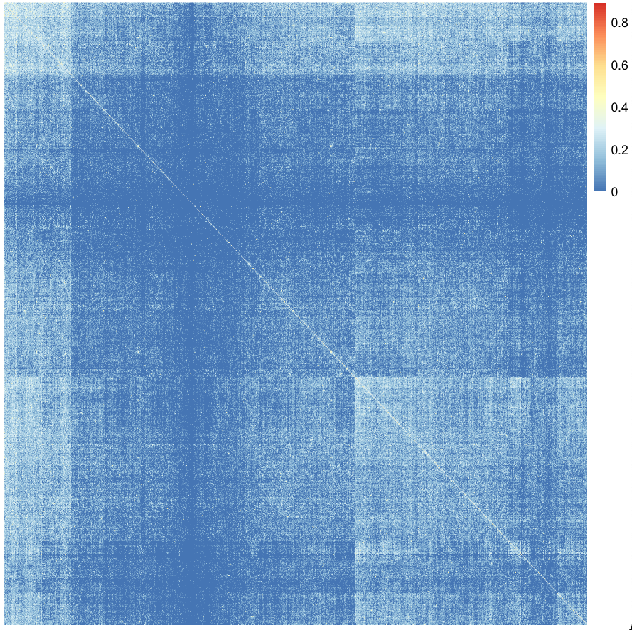

# Estimating relatedness

Now let's estimate the relatedness between different individuals in the dataset.

## Genome-wide relatedness
In doing this we are typically interested in **genome-wide patterns of relatedness**, so a good idea is to capture as many 'independent' regions of the genome as possible.  Local LD patterns which arise due to random genetic drift, are of less interest to us for this purpose.  So to do this, it's typical to first 'prune' the dataset by LD to produce a set of variants that are approximately in linkage equilibrium, removing tightly linked regions of the genome that could influence relatedness calculations.  

There are a few ways one could do this including simply thinning data by position, but the most often-used method in `plink`is to prune variants so that there are none left above a particular linkage disequilibrium $R^2$ cutoff.  (Here $R$ denotes the correlation in genotypes between two loci.)  We'll use a cutoff of $0.2$ here, that is, will remove one of each pair of variants that have $R^2>20%$. 

The command will produce two output files containing variants to retain in the data (`AMR_genotypes.prune.in`) or to exclude from the data (`AMR_genotypes.prune.out`) for relatedness calculations.

```sh
./plink \
--bfile Genotype_data/AMR_genotypes \
--indep-pairwise 50 5 0.2 \
--out output/AMR_genotypes
```

:::tip Note

`--indep-pairwise` actually works in overlapping windows along the genome, and excludes variants within each window so that none remain with greater than the given threshold.  The arguments `50 50 0.2` can be read as: "work in windows of 50 variants, shifting by 5 variants each time, and exclude variants with $R^2 > 20%$." (See the [`--indep-pairwise` documentation](https://www.cog-genomics.org/plink/1.9/ld#indep) for more information.)
:::


:::tip Caution

There is also a danger of using LD-based pruning like this.  Because LD arises when variants 'drift' (or are selected) up to high frequency, common variants are **more likely to be in high $R^2$ with each other**.  In pracrice this means that this approach is likely to skew the frequency distribution of the variants.  You can see that by summarising in this data:

```r
frequencies = readr::read_table( "output/AMR_genotypes.frq" )
included_snps = scan( "output/AMR_genotypes.prune.in", what = character() )
frequencies$included = (frequencies$SNP %in% included_snps)

(
	frequencies
	%>% group_by( included )
	%>% summarise(
		low = length( which( (MAF < 0.05))),
		total = n()
	)
	%>% mutate( low_proportion = low/total )
)
```
which will print something like:
```r
# A tibble: 2 × 4
  included   low total low_proportion
  <lgl>    <int> <int>          <dbl>
1 FALSE     1596  3495          0.457
2 TRUE       853  1337          0.638
```

The pruning has reduced the overall frequency of the variants.

Another, simpler approach to pruning is simply to exclude variants by physical position - or else by position in a recombination map.  For example, [this GWAS of Multiple Sclerosis](https://www.nature.com/articles/nature10251) used intervals of $0.25 \text{centi-Morgans} \pm 25\text{kb}$, determined using the HapMap combined recombination map, to define 'independent' association intervals.  

We'll stick with the LD pruning for now.

:::

We can now use one of these files in combination with the `--genome` flag to generate a relatedness summary table:

```sh
./plink \
--bfile Genotype_data/AMR_genotypes \
--exclude output/AMR_genotypes.prune.out \
--genome \
--out output/AMR_genotypes.relatedness
```

## Plotting relatedness

If you look at the output file `AMR_genotypes.relatedness.genome` using e.g. `less` you'll see it looks something like this:
```
     FID1      IID1      FID2      IID2 RT    EZ      Z0      Z1      Z2  PI_HAT PHE       DST     PPC   RATIO
     AMR_0     AMR_0     AMR_1     AMR_1 UN    NA  1.0000  0.0000  0.0000  0.0000  -1  0.889992  0.0787  0.8000
     AMR_0     AMR_0     AMR_2     AMR_2 UN    NA  1.0000  0.0000  0.0000  0.0000  -1  0.882376  0.8944  7.0000
     AMR_0     AMR_0     AMR_3     AMR_3 UN    NA  0.6243  0.3757  0.0000  0.1878  -1  0.901750  0.7603  3.5000
     AMR_0     AMR_0     AMR_4     AMR_4 UN    NA  0.7987  0.2013  0.0000  0.1006  -1  0.893795  0.9214  8.0000
     AMR_0     AMR_0     AMR_5     AMR_5 UN    NA  0.7417  0.2583  0.0000  0.1292  -1  0.898574  0.9214  8.0000
     AMR_0     AMR_0     AMR_6     AMR_6 UN    NA  0.8491  0.1509  0.0000  0.0755  -1  0.891860  0.3274  1.5000
     AMR_0     AMR_0     AMR_7     AMR_7 UN    NA  0.9898  0.0102  0.0000  0.0051  -1  0.893302  0.9214  8.0000
     AMR_0     AMR_0     AMR_8     AMR_8 UN    NA  0.9105  0.0775  0.0120  0.0507  -1  0.897525  0.5000  2.0000
```

It has one set of results **for every pair of samples** in the data.  On each row, the first sample is identified by `IID1`, and the second by `IID2`.

:::tip Note
These files also contain `FID` fields.  Nominally, these are used to indicate 'family identifiers'.  However, in this GWAS, we have sampled individuals randomly so they weren't collected in families, so we've just set the `FID` the same as the `IID`.
:::

Let's load that into R and plot it.  We'll plot `PI_HAT` which is the estimated proportion of the genome shared
'identical by descent' (IBD) between the two samples.  To plot it we'll first load the data and turn the data into
matrix form - this requires a bit of code to do.  First, let's load the data and get a list of samples:

```r
ibd = readr::read_table( "output/AMR_genotypes.relatedness.genome" )
samples = unique( c( ibd$IID1, ibd$IID2 ) )
```

First, we'll turn the identifiers into indexes so we can index rows of the matrix:
```r
ibd$index1 = as.integer( factor( ibd$IID1, levels = samples ))
ibd$index2 = as.integer( factor( ibd$IID2, levels = samples ))
```
Now let's create a matrix to put the results in:
```r
N = length(samples)
ibd_matrix = matrix(
	NA,
	nrow = N,
	ncol = N,
	dimnames = list( samples, samples )
)
```
Finally, we can use a short-hand syntax to fill in the values:
```r
ibd_matrix[ as.matrix(ibd[,c("index1", "index2")]) ] = ibd$PI_HAT
image(
	ibd_matrix,
	x = 1:N,
	y = 1:N
)
```

Cool!  However, a nicer plot can be made with the `pheatmap` package.  To make this work we'll fill in the lower diagaonal as well:
```r
ibd_matrix[ as.matrix(ibd[,c("index2", "index1")]) ] = ibd$PI_HAT
pheatmap(
	ibd_matrix,
	show_rownames = FALSE,
	show_colnames = FALSE,
	treeheight_row = 0,
	treeheight_col = 0
)
```
This might take a moment or two... and you should see something like this:


:::tip Question

It would also be useful to plot a **histogram of IBD values** - can you do that?

What pair of samples has the most IBD?
:::

:::caution  A note about these relatedness values

The data we are looking at here are actually simulated from a small region (about 5Mb) of the genome.  Because of that
it is not possible to accurately calculate relatedness between individuals in this data - what you are looking at is
therefore a not-very accurate estimate of relatedness based on just these data.

In a real GWAS, if samples were supposed to be sampled independently, finding high relatedness might be unexpected and
so you might typically want to remove one of each pair of closely related samples.  We'll see how you could do that in a
moment.

:::
