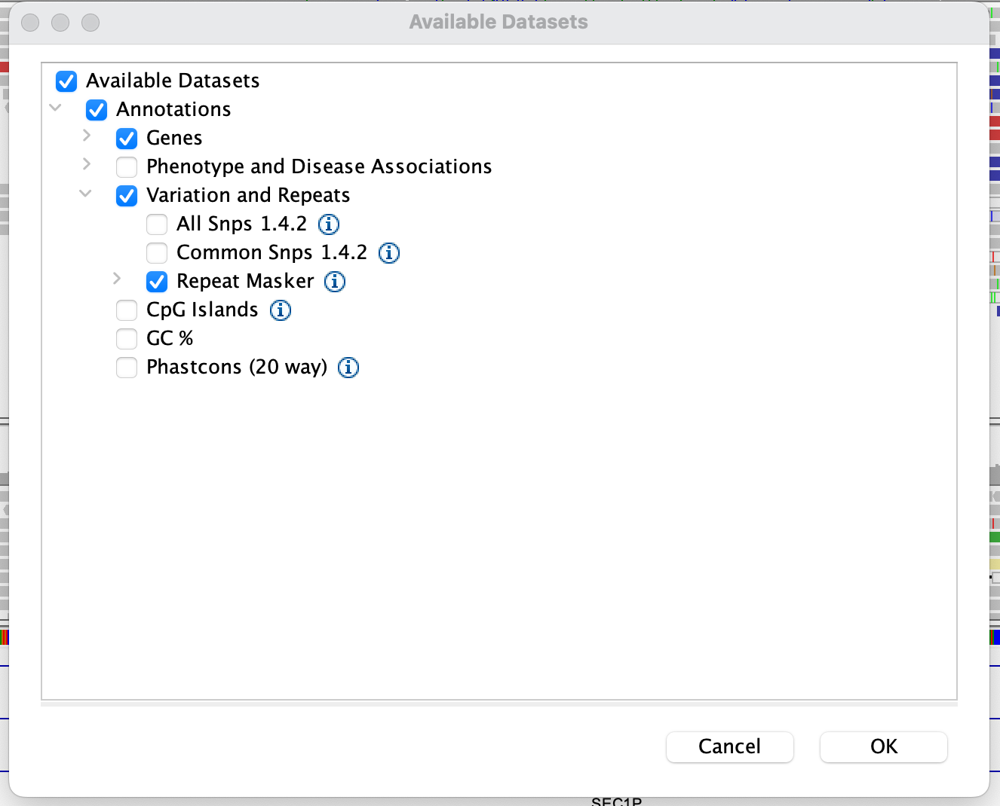

# Dataset A: Illumina paired-end

**File URL**: 
```
https://www.chg.ox.ac.uk/bioinformatics/training/gms/data/sequence_data_sightseeing_tour/illumina.bam
```
(For index URL, add `.bai`).

You should be familiar with this type of data by now, as it's what the [earlier
practical](../README.md) was all about. The data has 150bp paired-end reads and was
generated on the [Illumina Novaseq 6000](https://emea.illumina.com/systems/sequencing-platforms/novaseq.html) platform.

:::tip IGV hints

This is a good point to try a few options to get used to IGV.

* For paired-end data, try the 'view as pairs' option. It can be found in the context menu, obtained by right-clicking
  anywhere on the track.

* Try clicking on a read.  What is all that info?  Where does it come from?

* Try moving around and zooming in/out.  

* If you don't like how reads are displayed, try 'collapsed', 'expanded', or 'squished' from the context menu.  Which one do you like best?

:::

:::caution Warning

A reminder that all data in this sightseeing tour is included strictly for training purposes - it is **not**
publicly-available data. Please do not share outside this course.
Contact me (Gavin Band) if you have any queries about this.

:::

## Questions

Can you find:

* a heterozygous SNP?  A homozygous SNP?
* an INDEL (short insertion or deletion variant)?
* a sequencing error?


:::tip Poorly alignable regions

Short reads don't always align very well to the genome.

One reason for poor alignment is that the underlying DNA is repetitive - that is, the same read might have come from multiple source locations.
This is characterised by **low mapping qualities** of the reads.

Another thing that might cause poor read alignment is if  the reference genome doesn't represent the structure of the sample genome very well.
This would be a **genome structural variant**.

:::tip Question

Try pointing IGV at this locus - can you make out what is going on?

- `chr19:48,669,128-48,669,589`

**Hint** try zooming in until you can see the base-level information in the genome sequence.  Do you notice anything?

:::

Repetitive regions are hard for the aligner, but they are also hard for the DNA replication machinery, which just like
the aligner, can 'misalign' two copies of DNA during replication, leading to genomic structural variation.

:::tip Annotations in IGV

To see whether this repeat is a known microsatellite or other repetitive element, you can try turning on the 'repeat
masker' annotations in IGV.  A useful one is 'RepeatMasker' track. To view it, go to the `File` menu and choose `Load
from Server`.  Expand the tabs and find the 'Repeat Masker' track under 'Variation and Repeats':



The Repeat Masker tracks appear at the bottom, under the 'RefSeq genes'.  (You may have to scroll down to see it.)

**Note** More repeat annotation tracks are available in the [UCSC genome browser](https://genome.ucsc.edu).  This one can actually be seen in the 'Simple Tandem Repeats' track (which you have to turn on, near the bottom of the browser page) indicating it is a `CATCACCAC` repeat - is that what you thought?
:::


When you're ready, move on to [Dataset B](dataset_b.md).

