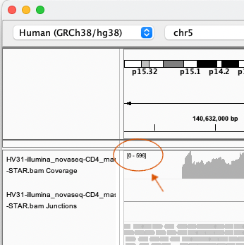

# Dataset D: Illumina RNA-seq

**Dataset URLs**:
```
https://www.chg.ox.ac.uk/bioinformatics/training/gms/data/sequence_data_sightseeing_tour/rnaseq-monocytes.bam
```
**Additional dataset URLs, for other cell types**:
```
https://www.chg.ox.ac.uk/bioinformatics/training/gms/data/sequence_data_sightseeing_tour/rnaseq-cytotoxic-T.bam
```
```
https://www.chg.ox.ac.uk/bioinformatics/training/gms/data/sequence_data_sightseeing_tour/rnaseq-b-cells.bam
```

RNA-seq sequences (guess what?) RNA instead of DNA - usually messenger RNA (mRNA).

For the most part it's only genes that get transcribed to mRNA, and only exons that end up in the mature mRNA. So you should see clear patterns of reads above exons and much less
coverage elsewhere.

Different genes are expressed to different amounts, however, so you might have to look at a few genes to really see
what this looks like.

:::caution Warning

A reminder that all data in this sightseeing tour is included strictly for training purposes - it is **not**
publicly-available data. Please do not share outside this course.
Contact me (Gavin Band) if you have any queries about this.

:::

## Questions

* What does *FUT2* look like in the RNA-seq data?
* What about *CD14* (CD14 is a cell marker for monocytes).
* What about *UBASH3A*?  
* *GNAS*?

:::tip IGV hint

The coverage tracks have 'Autoscale' turned on - the scale is printed at the top-left of the track, as shown here:


Keep this in mind when comparing genes or tracks for RNA-seq data - the scale will vary a lot as you move around the genome.

:::

