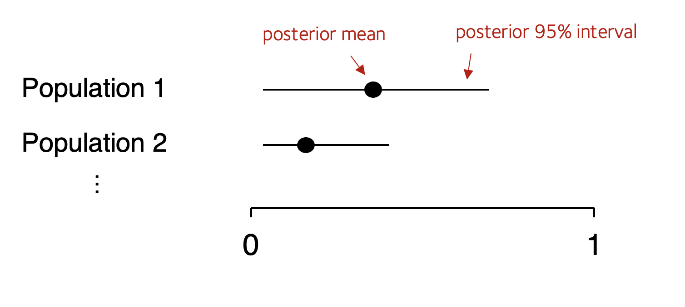

# A bayesian forest plot

The plot [we just made](./allele_frequencies.md) is ok, but surely visually pretty wasteful.

For most purposes a better alternative is **forest plot** - that is a plot showing *point estimates* and their *95% credible intervals*.

## Making a forest plot

:::tip Challenge question

Create a **forest plot** for these estimates, that is, a plot of the posterior mean estimates and the 95% intervals.
Schematically it should look schematically something like this:



For **extra kudos**, make a version with a prior (e.g. $n_A = n_B = 5$, for example, or a prior of your choice) and compare to the without-prior version.

:::

## Forest plot 'howto'

In case you're stuck here is a guide.

First, instead of that function `compute_posterior_density()`, write a simpler function `compute_posterior_summary()` that summarises the posterior, like this:

```r
compute_posterior_summary = function(
	nA, nB,
	prior = c( nA = 0, nB = 0 )
) {
	return(
		data.frame(
			posterior_mean = # your calculation here
			q2.5 = # your calculation here
			q97.5 = # your calculation here
		)
	)
}
```

As indicated, it should return the data we need for the forest plot. (Returning this as a dataframe with one row works best).
The columns should be the posterior **mean** and - to find an interval containing 95% of the mass - the **2.5%** and **97.5% quantiles**.   (Feel free to add other quantiles as well - for example the 50% quantile, which is also known as the **median**.)

:::tip Note
If you're working in R, you can compute the quantiles using the `qbeta()` function.  For example to get the 2.5% quantile:
```r
qbeta( p = 0.025, shape1 = nB+1, shape2 = nA+1 )
```
(though you should also add the prior information in, of course!)
:::

Happily, it turns out that the posterior mean is just the frequency estimate you would have made from the data
anyway:

$$
\text{posterior mean} = \frac{n_B}{n_A+n_B}
$$
...so that's easy to compute as well.  

Once you've written your function, you could use it like this to compute a summary:

```r
posterior_summary = (
	data
	%>%	mutate(
		nA = ( `C/C` + `-/C` ),
		nB = ( `-/-` )
	)
	%>% group_by( population )
	%>% summarise( compute_posterior_summary( nA, nB, prior = c( nA = 0, nB = 0 )))
)
```

You should end up with a data frame looking something like this:
```
population            n1    n2   posterior_mean   q2.5   q97.5
African Ancestry SW   32    29            0.475  0.355   0.599
(etc).
```

Now let's change the plotting code so it plots a forest plot.
See the comments below for an explanation

```r
p = (
	ggplot( data = posterior_summary )
	+ geom_point( aes( x = posterior_mean, y = population ))
	+ geom_segment( aes( x = q2.5, xend = q97.5, y = population, yend = population ))
	# Always make your plot have good axis labels!
	+ xlab( "Posterior mean and 95% CI" )
	+ ylab( "Population" )
	# A clean, large-font theme:
	+ theme_minimal(16)
	# Rotate y axis label so it's not at 90 degrees:
	+ theme( axis.title.y = element_text( angle = 0, vjust = 0.5 ))
)
print(p)
```

**Note.** If the points are not in order, you can [order them in the data](./allele_frequencies.md#ordering-populations) before re-running the above.

:::tip Question

Which plot do you like better - the [full posterior](./allele_frequencies.md) or this one?

Do the 95% intervals all overlap?

:::

:::tip Comparing a prior

As a final task, compare the bayesian shinkage and non-shrinkage estimates by plotting different values side-by side.
Here is an easy way to do this:

1. Update the above code to add an extra column called `prior` to the `posterior_summary` data frame. The above had no prior data, so give it the value 'none'.
2. Now add *extra rows* to `posterior_summary` for a chosen different prior - say `nA=5`, `nB=5` or other values of your choice.  (Make sure to change the `prior` column to something different, like '5,5'!)

**Note**. the `rbind()` function in R (as well as `dplyr::bind_rows()`) will concatenate two data frames, row-wise.

3. Lastly, try re-making your plot but adding
```
+ facet_grid( . ~ prior )
```
into the ggplot command to put the two plots side by side.

:::

