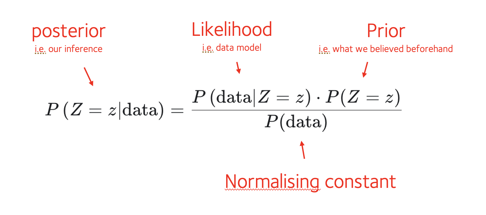

# The most important formula in science

The most important formula is... Bayes theorem!

Let's write it now. Suppose $Z$ is *something we care about* - say, a scientific theory, or the chance of having disease.
We collect some data to tell us about it. Bayes' theorem now tells us that:

$$

P\left(Z=z|\text{data}\right) = \frac{P\left(\text{data}|Z=z\right) \cdot P(Z=z)}{P(\text{data})}

$$

Bayes formula tells us how to update what we should believe about $Z$, given some new data:

* The left-hand side $P(Z=z|\text{data})$ represents our new belief (distribution of $Z$ given the data).  
* The right-hand side involves a model for the data $P(\text{data}|Z=z)$, and a term $P(Z=z)$ representing what we *used* to believe about $Z$ before we saw the data.  (There's also a denominator, which like for other distributions acts as a normalising constant.  We'll come back to this below.)

The pieces of Bayes' theorm have specific names and interpretations in statistical analysis, as follows:

## Using Bayes in practice

In principle, it's easy to use Bayes.  We do this:

1. Collect some data about $Z$.
2. Write down a model of the data (the likelihood function).
3. Work out what prior information we have about $Z$.
4. And then apply the formula.

In pratice this can be easy or difficult, depending on how complicated it is to define the likelihood and prior.  We'll do some examples in a moment to make this clear.

## The denominator

You might be thinking - what's that denominator, why is it a 'normalising constant' - and how would you compute it?

Here are a few things to note:

1. The denominator is 'constant' in that it does not depend on $Z$. (There's no '$Z$' in $P(\text{data})$).

2. Like all [distributions](./distributions.md), the posterior distribution is supposed to sum to $1$ over possible values of $Z$.

3. The denominator is *just the value needed* there to make the posterior sum to  $1$ over all possible values of $Z$.

The denominator therefore plays the same role as 'normalising constants' for [other distributions](./some_distributions.md).

## Computing the denominator

So how do we compute the normalising constant?  Here are a few things to note.

**First**, in some settings, where we're only interested in relative values of the posterior for different values of $Z$, we **might not need to compute the denominator at all**.  Its only job is to normalise things into absolute probabilities.

**Second**, in many problems everything works out 'analytically', meaning that the mathematical form of the posterior is already known - nothing more needed to compute.  (For example, the posterior might be a [beta distribution](./some_distributions.md) or a [normal distribution](./some_distributions.md)).

**Lastly**, we can always compute the denominator by summing the numerator over all the possible values of $Z$.  In other words, we write it out using the [law of total probability](../probability_cheatsheet.md):

$$

\text{denominator} = P(\text{data}) = \sum_y P\left(\text{data}|Z=y\right) \cdot P(Z=y)

$$

For a continuous variable $Z$, this would be an integral.

We'll do some examples of both these methods in a moment.

:::caution

Working out this sum can sometimes be harder.  In this case computational methods like **Markov Chain Monte Carlo** (MCMC), **Laplace approximations** or **Variational approximations** are typically needed.  Although these sound complicated, they're really just numerical ways to compute this denominator, and there are plenty of easy-to-use tools to do this.  

We won't get into these for now because there are plenty of useful examples where they aren't needed.

:::
