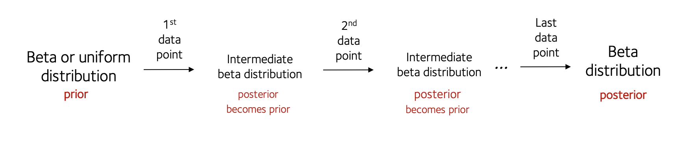

# The bayesian update

Now let's consider a more complex situation.

:::tip Scenario

Imagine we're interested in a genetic variant which has two alleles **A** and **B**.  We sample some chromosomes from a large
population and want to use Bayes to estimate the allele frequency.  

:::

## How does Bayes theorem learn?

How does Bayes theorem update what we should believe?  To find out, type your observed alleles (a list of A's and B's) into the **Bayesian update-o-meter™** below:

<iframe src="/chg-training-resources/html/bayesian_update.html" width="1000px" height="600px"> 
</iframe>

What you are seeing is the **bayesian update**.  With each observation you make, Bayes' theorem computes its new belief (i.e. the posterior distribution) about the frequency of the 'B' allele.

The **solid line** shows the current posterior.  The **dashed line** shows the posterior one data step before (i.e. before the last observation).

The **text on the right** shows the posterior mean estimate (that is, the mean of the distribution) - and its mode (most
likely value), if it has one.  (When are these the same?)

:::caution Note

The *order* of A's and B's does not matter to the posterior, just their number.

:::

Play around with this a little and then try these questions.

:::tip Questions

* Press 'reset' data (and/or 'reset prior') or delete the data to get back to the start.
* Add a single 'A' allele observation.  What does the posterior look like?  What is the 'best guess' allele frequency estimate?
* Delete it and add a single 'B' allele observation instead.  What does the posterior look like?  What is the 'best guess' allele frequency estimate?
* What if you add two 'B' alleles? Three?  How many do you have to be really confident the frequency is 100%?
* Now try adding a mixture of 'A' and 'B' alleles.  For example, try four `A`s and two `Bs`.  What does the posterior look like?

:::

Feel free to play around with this until you understand how the data affects the posterior.

## Adding prior information

So far we have not added any prior information.  Let's try that now. Reset the data again to get back to the start.

:::tip Prior data example
Suppose we already had data on this population - for example, suppose we'd done a pilot experiment and already observed five of each allele.

Model this now by setting 'Prior A' and 'Prior B' to 5 in the boxes underneath the data.

Now you can see that, before we start collecting our new data, we are already reasonably sure that we have an allele
frequency somewhere in the middle of the range - although it's still pretty uncertain.

What happens now as we add data (for example, four `A`s and two `B`s again)?  Is the change in posterior with each
additional data point more, or less dramatic than it was before?  (If you press 'reset data' you can see how the inference with prior data compares to the inference without.)

:::

What you are seeing is **bayesian shrinkage**.  The prior information acts to 'shrink' the estimates (and the whole distribution) towards the prior estimate.

## Maths explanation

In this scenario it turns out that:

1. **The likelihood function is a [binomial distribution](./some_distributions.md#binomial-distribution).**

**Explanation**: Suppose the frequency of the 'B' allele is $p$.  As we start sampling, we therefore expect to observe a
'B' allele with probabilty $f$ - and an 'A' with probability $1-f$.  Let's imagine that the population is so large that
our sampling does not affect this frequendcy much.  To get the likelihood of any sequence, we therefore just multiply
over the alleles drawn - for example
$$
P(BBA|f) = p^2(1-p)\quad\text{and}\quad P(AABAABB|f) = f^3 (1-f)^4
$$
In general, if the sequence has $n_A$ 'A' alleles and $n_B$ 'B' alleles the likelihood is just:

$$
\begin{align}
\text{likelihood}(f) = P(\text{data}|f) = \text{constant} \times
f^{n_B}\cdot(1-f)^{n_A}
\end{align}

$$

This is the form of a [binomial distribution](./some_distributions.md#binomial-distribution).

(The 'constant' is just here because we switched to thinking of the data as counts $n_A,n_B$ instead of the full
sequence - we have to count the number of sequences with those counts.  The constant doesn't depend on or hold any information
about $f$, and so isn't very important.)

2. **The prior is flat**. . In this example we have put in no prior information so the **[prior](./bayes.md)** is
$$
\text{prior}(f) = P(f) \equiv 1
$$

3. **The posterior is a beta distribution**. Multiplying the prior and likelihood, and normalising as in [Bayes theorem](./bayes.md), the **[posterior](./bayes.md)** is therefore just
$$
\begin{align}
\text{posterior}(f) = P(f|\text{data}) = \text{another constant} \times f^{n_B}\cdot (1-f)^{n_A}
\end{align}
$$

If this looks a lot like the likelihood, that's because it is!

A quick glance at [the expression for a beta distribution](./some_distributions.md#beta-distribution) will show you that
this is just the form of a beta distribution - in fact it is:

$$
f \sim \text{beta}(n_B+1, n_A+1)
$$

:::tip Key point

The only difference here between the likelihood and posterior is in the **constant**.  

The constant in the likelihood is supposed to normalise the distribution over all possible values of data.  If the data is the number of 'A' and 'B' alleles in the data, the constant is $A+B\choose B$ as shown in the [definition of the binomial distribution](./some_distributions.md).  (On the other hand, if we think of the whole ordered sequence of A's and B's as the data, the constant is just $1$.)  Either way, this term is *constant with respect to the frequency $f$* so it doesnt really matter what it is - it's just a constant.

On the other hand, the constant in the posterior has the job of normalising the distribution over all possible allele frequencies $f$.
This is where knowing the mathematical form of the beta distribution is useful - it can be worked out, and turns out to be
$$
\frac{1}{B(n_A+1,n_B+1)}
$$
where $B()$ is a particular function called the *[beta function](https://en.wikipedia.org/wiki/Beta_function)*.  (If you read its definition, you'll see it is, essentially, defined as just the function needed to normalise this distribution.)

Therefore, even though in principle we'd have to work out the normalising constant to figure out the posterior (as we
did in the [covid example](./covid.md) - here it is **determined by the maths**.  Someone has worked it out for us
already, how nice of them!

:::

So what happens if we add prior information?  Well if we assume the prior is *also* a beta distribution, say:
$$
\text{prior}(f) = \text{a constant} \times f^x \cdot (1-f)^y
$$

then all the maths works out again:
$$
\begin{align*}
P(f|\text{data},x,y) & = & \frac{f^{n_B} (1-f)^{n_A} \cdot f^x (1-f)^y}{\text{normalising const.}} \\
\\
& = & \frac{f^{n_B+x} (1-f)^{n_A+y}}{\text{normalising const.}} \\
\\
& = & \text{beta}( n_B+x+1, n_A+y+1 )
\end{align*}
$$

(The normalising constant is again determined as before by the form of the function.)

:::tip Note
The beta and binomial distributions have this dual relationship to each other, because they have overlapping
mathematical forms.  In bayesian stats parlance they are said to be **conjugate**.

Of course - we could also use a different prior distribution (not a beta distribution). That's not a *conceptual*
problem but the maths won't work out the same way - we might then need numerical integration, or something, to solve it.

:::

In short, you can either think of the inference as processing all the data at once:

...or as processing the data points one at a time:

Either way, Bayes theorem gives the same answer.

