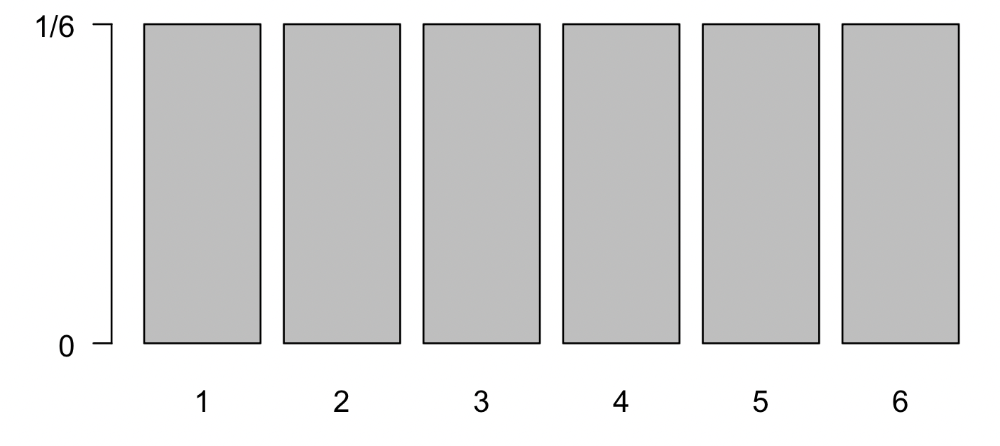
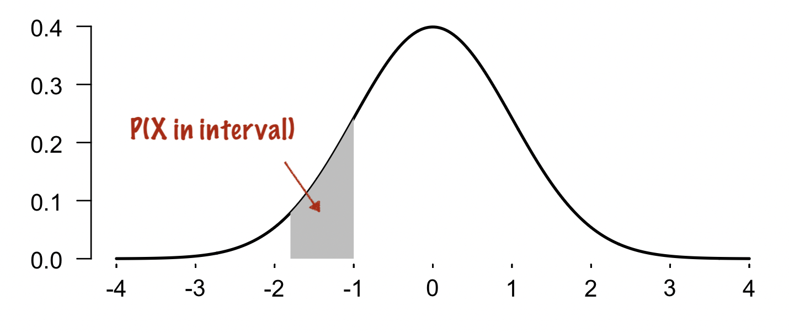

# Distributions

In statistics, the way uncertainty is accounted for is through  **probability distributions**.  

Suppose we are interested in a variable $X$.  A distribution for $X$ is just a function that distributes a total of 100% probability 'mass' over the possible values of $X$.

For example, here is the distribution of the roll of a normal 6-sided die:

The die has $6$ possible outcomes $X=1,\cdots,6$, and the function assigns probability mass $\tfrac{1}{6}$ to each of them.  Across all possibilities it adds up to $1$ (i.e. $100\%$ total probability.)  Simple, right?

Simple distributions like this one can often be worked out just by counting possibilities.  For example, let's warm up with an exercise:

:::tip Question

What is the distribution of the sum of two dice rolls?  Use a pen and paper to draw it.

**Hints**

This can be worked out just by counting the possibilities.  For example, there are $4$ possible dice rolls that generate the value $5$, and there are $36$ possible dice rolls in total.  So there ought to be $\tfrac{4}{36} = \tfrac{1}{9}$ chance of rolling a $5$.

:::

For a continuous variable $X$ things are *slightly* more complicated because to get an actual probability we typically have to think in terms of *ranges* of values.  For example, here is the density of a normal distributed variable:

Like the dice example, the function sums to $1$ over the whole real line.  As shown on the plot, to read off the probability that $X$ is in any given part of its range, we just sum up (integrate) the density over the range.  (So the density function itself isn't returning a probability at each point - the probability of any specific value is vanishingly small) - but something that sums up to a probability over any range of values).

