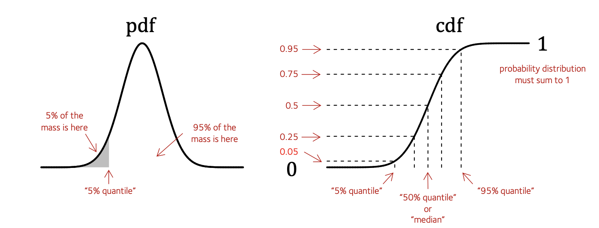

# Quantiles, p-values and all that

Consider a variable $X$ that is normally distributed - here is a picture of its distribution:

I've annotated this with various pieces of information.

On the **left** is shown the *probability density function* or **pdf**.  You could compute this using `dnorm()` in R as we did [on this page](./some_distributions.md).

To fix terminology I've labelled a particular point on the X axis - the $5\%$ quantile.  That means: the value $x$ such that **exactly 5% of the mass of the distribution is $\leq x$**.

On the **right** is shown the *cumulative density function* or **cdf**.  You can compute using `pnorm()` in R.
The cdf is just worked out by summing up (that is, *integrating*) the area under the pdf from left to right.

:::note Note
Since this is a distribution, the **total area under the distribution is $1$**. That means the cdf must asymptote to $1$ on the right - look, it does!
:::

## Quantile levels and p-values

As the red annotations indicate, the cdf is the function that maps values of $X$ and tells you which quantile they correspond to - i.e. how much mass is to the left of them.  For example:

:::tip Question

Use `pnorm()` to answer: for a normal distribution with mean 10 and standard deviation 3, how much of the probability mass is $\leq X=1$?

**Hint**. If stuck, check the help page to see how to use it.  In particular `pnorm` uses the name `q` (for 'quantile') instead of `x`.

:::

## What's a p-value?

A p-value is essentially **just the same thing as the cdf** - but usually applied to a particular observation. 

:::note Definition
If a variable $X$ is assumed to have a given distribution, and we observe a value $x$, the **P-value** corresponding to $x$ is just the mass under values 'at least as extreme' as $x$.
:::

I hope you can see the the way to compute a P-value is $\text{cdf}(x)$.

However we do get a bit of leeway in this definition to fit this to our purpose, depending on what we want to capture by 'more extreme'.  For example:

* If values *less than* $x$ are considered 'more extreme', we might compute:
$$
\text{P-value} = \text{cdf}(x)
$$

* If values *greater then* $x$ are considered 'more extreme', we might instead compute the upper tail probability which is one minus the lower tail:
$$
\text{P-value} = 1 - \text{cdf}(x)
$$

:::tip Note
In R, you can compute this directly by adding `lower.tail = FALSE` in your `pnorm()` call.
:::

* We might be thinking that values *greater than $x$ in magnitude* are 'more extreme', in which case we'd take something along the lines of:

$$
\text{P-value} = \text{cdf}(x) + \left(1-\text{cdf}(-x)\right)
$$

This is a 'two-tailed' p-value which picks up both tails of the distribution.

## Finding quantiles

You might also want to go the other way: that is, finds the value of $X$ corresponding to a given quantile (such as 5% or 25%).
This is the job of the **quantile function**.  If you look at the right-hand diagram above, you'll see that the quantile function is just the inverse of the cdf (it maps the y axis values back to the x axis).

:::tip Question

Use `qnorm()` to answer: For a standard normal distribution (with mean 0 and standard deviation 1), what's the 2.5% quantile at?

**Hint**. Again, the help page might help.  `qnorm()` uses the name `p` for the choice of quantile, eg. `p=0.025` in the above.

How does the 2.5% quantile change as you change the standard deviation?

:::

