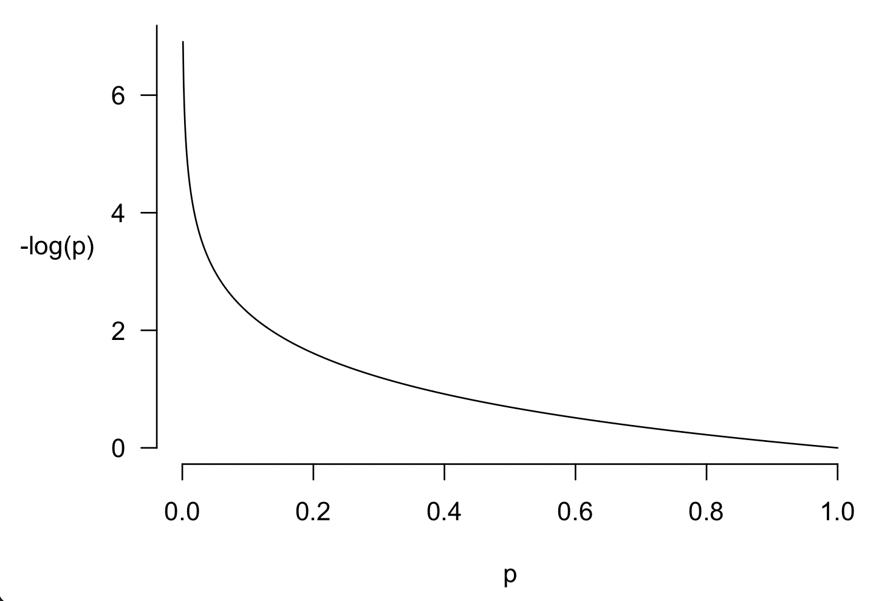

# Distribution summaries

We can also handle distributions by creating some single-number **summaries** of the distributions.

If $P(x)$ is a distribution function, here are a few commonly encountered summaries:

| Name | Symbol | Description | Expression |
| ---- | ------ | ---------- | ----------- |
| **Mean** | $\text{mean}()$ | Average (or mean) **value** <small>Also known as 'expected value' or 'expectation'</small> | $\sum_x P(x)\cdot x$ |
| **Variance** | $\text{var}()$ | Average **squared distance to mean** <small>where $\mu = \text{mean}(X)$</small> | $\sum_x P(x)\cdot (x-\mu)^2$ |
| **Entropy** | $H()$ | The average negative log probability <small>interpreted as the average amount of 'information' in a value of $X$</small> | $-\sum_x P(x) \ln\left(P(x)\right)$  |

What you'll note about these summaries is that they all have the **same form**.  We are forming an average of some quantity over all possible values of $X$, with the average **weighted by the probability**.  The quantity averaged is either:

* The value itself, leading to the mean or average value
* The (squared) distance of the value to the mean, forming the variance.  This is a measure of how 'spread out' or 'uncertain' the distribution is.  If most of the likely values are close together (i.e. we are relatively certain about the value), the variance will be low, but if the probability mass is spread out a lot then the variance will be high.
* Or (minus) the logarithm of the probability itself, forming the entropy.  This is another measure of how 'uncertain' the distribution is.  We won't make much use of it in this course but you may come across it.

:::tip Challenge

On the [previous page](./distributions.md) you computed the distribution of the sum of two dice rolls.

Now compute the mean, the variance and standard deviation, and the entropy.  (Use a computer or calculator to do this - the results won't necessarily be nice round numbers.)

What happens to the mean, the variance and the entropy if we change the distribution?  For example what if you make the middle value $7$ have higher probability (and scale other values down accordingly so that it still sums to $1$).  What happens if you make the distribution completely 'flat' (i.e. give the same probabilty to every possible value)?

:::

## Understanding variance

Variance is a measure of the 'uncertainty' of a distribution.  It measures the average squared distance of values to the mean.

Intuitively, what this means is that if a lot of the distribution is far from the mean (i.e. the distribution is 'spread out'), the variance will be large.  While if most of the values are close to the mean, the variance will be small.

:::tip note

Why 'squared distance' instead of something else, like 'absolute distance' here?  There's nothing to stop you measuring 

:::

## Understanding entropy

We won't make much use of entropy in this course, but here is an explainer in case you are interested.

One way to think of the entropy is like this.  Imagine we draw a value $X=x$ from the distribution.  Suppose we measure
how 'surprising' this value is as the negative logarithm of its probability:

$$
\text{surprisingness}(x) = -\log P(X=x)
$$
The entropy is just the *average surprisingness*:
$$
H(X) = \sum_x P(X=x)\cdot\text{surprisingness}(x)
$$

Why is this a sensible definition of "surprisingness"?  Well, here is a graph of $p \mapsto -\log(p)$:

Note that:
* When $p$ is large (close to $1$), then $-\log(p)$ is close to zero. This matches the fact that observing a value that is very likely, is **not very surprising**.

* On the other hand when $p$ is small (close to $0$), then $-\log(p)$ gets very large - in fact it goes to $+\infty$ at $0$. 
This matches the fact that observing a value that is very *un*likely, is **very surprising**.  (Infinitely surprising if actually had zero probability.)

Although I've called this 'surprisingness' above, another way to think of it is 'average information provided by an observation'  If the distribution is already very concentrated on one of a few values - i.e. entropy is low - we don't learn much about $X$ by observing it.  On the other hand if the distribution is very spread-out - i.e. entropy is high -  we learn a lot about $X$ by observing it.

The entropy, which is the average of $-\log(p)$, can therefore be thought of as the average surprisingness of an observation or the average amount of information added by an observation.

**Information and uncertainty are two sides of the same coin.**

:::tip Example

Imagine a distribution where all $100\%$ of the mass is on one value, so we are already completely certain about the value of $X$.  The logarithm of $1$ is $0$, so in this case the entropy works our as

$$
H(X)= -1 \times 0 = 0
$$

So entropy = 0 corresponds to the situation of 'no uncertainty'.

to the case where all the values $2,\cdots,12$ have the same probability $\tfrac{1}{11}$, so that we are, so to speak, 'completely uncertain' about the value of $X$.  Then the entropy is

$$
H(X) = -\sum_2^{12} \tfrac{1}{11}\cdot \ln\left(\tfrac{1}{11}\right) = -\ln\left(\tfrac{1}{11}\right) \approx 2.4
$$

Like the variance, the **entropy gets bigger** as the probabilty mass gets more spread out - higher entropy means more uncertainty.

:::